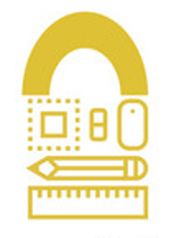

# Q2 Project Proposal 
1. Working title: Lockin
2. Second title: TaskTrack 
3. Logo:
    
4. Description: 
This is a website that helps with tracking your task and to help you not procrastinate. We have multiple tools such as a planner where you can schedule due dates, a goal page where you can set goals to achieve, a statistics page which helpes you see your statistics when it comes to doing requirements or stats, and an about us page where you can see our backrounds and why we made this website.
5. Outline of the website:
    - Home page: this page contains the links to the other pages and the description.
    - Planner: This page helps you track your tasks and the due dates.
    - Goals: this is a page that helps you set goals long for long term for example you want to get 10 tasks done by the end of the week.
    - Statistics: Shows all you statistics on this app like amount of tasks done or productivity rate.
    - Notes: Notes to yourself about things to do. You can store ideas, thoughts, and other references here on this tab.
6. Description of JS
    * Home page: Number of tasks left to do 
7. Wireframe:

